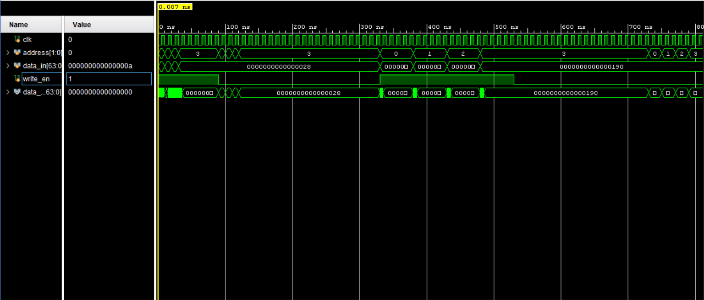

## Simulation Waveform

## Overview
This project implements a 4-register, 64-bit register file using Verilog HDL.

## Features
- Synchronous write operation
- Combinational read operation
- 2-bit register addressing
- Write enable control
- Testbench verification
